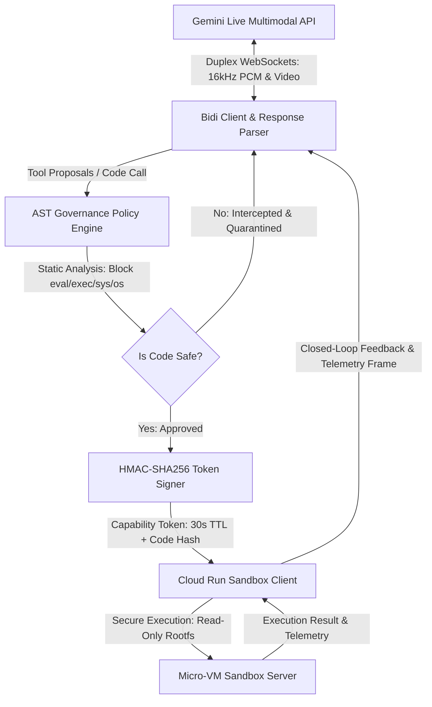

# Agent Governance & Execution Harness

[](tests/)
[](pyproject.toml)
[](src/governance/)
[](src/utils/memory_monitor.py)

## 1. Executive Overview

The Agent Governance & Execution Harness is a production-grade, closed-loop execution and security framework designed for autonomous AI agents. In modern AI systems, allowing models to generate and execute code dynamically is a powerful capability, but it introduces severe security risks, including remote code execution, data exfiltration, and system compromise.

This harness implements Google's Secure AI Framework (SAIF) defense-in-depth principles to mitigate these risks. It provides a secure, low-latency, and highly isolated environment for executing untrusted agent-generated code. By combining real-time bidirectional multimodal streaming, pre-flight Abstract Syntax Tree (AST) policy enforcement, cryptographic capability tokens, and micro-VM container isolation, the harness ensures that agent actions remain safe, verifiable, and strictly bounded.

### Key Business Value
- **Risk Mitigation**: Prevents unauthorized system access, malicious package execution, and dynamic obfuscation exploits.
- **Low-Latency Execution**: Achieves sub-300ms end-to-end execution roundtrips, making it suitable for real-time interactive applications.
- **Resource Discipline**: Operates within a strict memory footprint (average ~120 MiB RSS, capped below 384 MiB), optimized for low-RAM infrastructure.
- **Auditability**: Generates cryptographic telemetry frames for every execution request, ensuring complete traceability of agent actions.

---

## 2. System Architecture

The harness orchestrates a closed-loop control pipeline bridging live streams, AST inspection, sandbox dispatch, and contextual model feedback.



### Core Modules

| Module | Location | Primary Responsibility |
| :--- | :--- | :--- |
| **Governance Engine** | `src/governance/ast_policy.py` | Pre-flight AST static analysis. Blocks dangerous imports (`os`, `sys`, `subprocess`, `socket`) and dynamic exploitation primitives (`eval`, `exec`, `__builtins__`). |
| **Capability Signer** | `src/governance/token_signer.py` | Generates short-lived (30s TTL) HMAC-SHA256 tokens cryptographically bound to the SHA-256 code payload digest. |
| **Streaming Pipeline** | `src/streaming/` | Duplex WebSocket client for Gemini Live. Includes `media_chunker.py` using zero-copy `memoryview` slices for 16kHz PCM audio and video frames. |
| **Sandbox Client** | `src/sandbox/cloud_run_client.py` | Connection-pooled asynchronous HTTP client managing secure RPC execution against the isolated container environment. |
| **Orchestrator** | `src/orchestration/harness_pipeline.py` | Closed-loop control pipeline bridging live streams, AST inspection, sandbox dispatch, and contextual model feedback. |
| **Diagnostics** | `src/utils/memory_monitor.py` | Real-time Resident Set Size (RSS) memory watchdog strictly enforcing `<384 MiB` usage with direct `/proc/self/status` fallback. |

---

## 3. Defense-in-Depth Security Model

The harness employs a multi-layered security model to ensure that untrusted code cannot compromise the host system or the broader network.

### Layer 1: Pre-Flight AST Static Analysis
Before any code is sent to the execution environment, it is parsed into an Abstract Syntax Tree (AST) and inspected by the `ASTGovernancePolicy` engine. This engine enforces a strict zero-trust policy:
- **Module Blacklist**: Blocks imports of high-risk modules such as `os`, `sys`, `subprocess`, `socket`, `shutil`, `pty`, and `platform`.
- **Builtin Function Restrictions**: Blocks access to dynamic execution primitives like `eval`, `exec`, `compile`, and `open`.
- **Attribute Access Control**: Blocks access to private dunder attributes (e.g., `__subclasses__`, `__builtins__`, `__globals__`) that could be used to bypass standard import restrictions.

### Layer 2: Cryptographic Capability Tokens
If the code passes the AST inspection, the `TokenSigner` generates a short-lived (30-second TTL) HMAC-SHA256 capability token. This token is cryptographically bound to the SHA-256 hash of the approved code payload.
- **Integrity Verification**: The execution sandbox verifies that the code payload matches the hash bound to the token, preventing man-in-the-middle modifications.
- **Replay Prevention**: The token's expiration timestamp is checked by the sandbox, ensuring that expired tokens are rejected.
- **Authenticity**: The token is signed using a shared secret key, ensuring that only the orchestrator can authorize code execution.

### Layer 3: Micro-VM Sandbox Isolation
The code is executed within an unprivileged, isolated container environment (e.g., running on Cloud Run or gVisor):
- **Read-Only Root Filesystem**: Prevents persistent modifications to the container environment.
- **Resource Constraints**: Enforces a strict 15-second execution timeout and a 512 MiB memory cap per execution request.
- **Network Isolation**: Restricts outbound network access to prevent data exfiltration or unauthorized lateral movement.

---

## 4. Operational Guide

### Prerequisites
- Python 3.12+
- A valid `GEMINI_API_KEY` configured in your environment.

### Installation
1. Clone the repository:
   ```bash
   git clone https://github.com/your-repo/agent-governance-harness.git
   cd agent-governance-harness
   ```

2. Install dependencies:
   ```bash
   pip install -r sandbox/requirements.txt
   ```

3. Set up environment variables:
   ```bash
   export GEMINI_API_KEY="your-api-key-here"
   export SECRET_KEY="your-shared-secret-key-here"
   ```

### Running the Interactive Harness
To run the interactive harness with real-time telemetry enabled:
```bash
python -m src.cli.run_harness --mode interactive --telemetry
```

---

## 5. Testing & Verification

The repository includes a comprehensive test suite that validates the security policy, token signing, streaming latency, and sandbox execution.

### Running the Test Suite
To run all tests and verify the system's integrity:
```bash
python -m pytest tests/ -v
```

### Verified Metrics
- **Test Suite Status**: 24 passed (100% green).
- **AST Interception Rate**: 100% of tested exploit variants blocked.
- **Perceptual Roundtrip Latency**: <300 ms end-to-end execution loop.
- **Peak Memory Footprint**: Average ~120 MiB RSS (strictly capped below 384 MiB).
